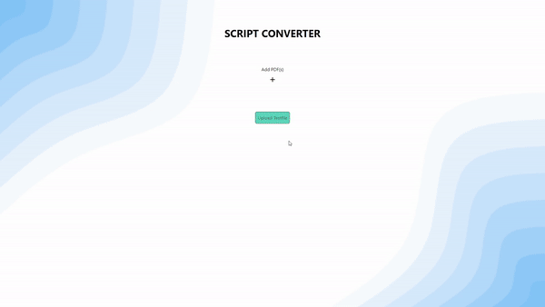

<h1 align="center">
  <br>
  What Is My Line
  <br>
</h1>

<h4 align="center">A simple application that converts your script to interactive components using <a href="https://www.python.org/" target="_blank">Python</a> and <a href="https://react.dev/" target="_blank">React</a>.</h4>

<p align="center">
  <a href="#key-features">Key Features</a> •
  <a href="#limitations">Limitations</a> •
  <a href="#how-to-use">How To Use</a> •
  <a href="#credits">Credits</a> •
  <a href="#description">Description</a> •
  <a href="#features">New Features</a> •
  <a href="#license">License</a>
</p>

<p align="center">
 
</p>

## Key Features

- Supports PDF files
- Upload your own scripts
- Google Drive integration
  - Upload from Google Drive
  - Create files and folders
- Google Cloud text-to-speech
- Practice with audio converted from text
- Drag and Drop support for Scenes and Lines
- Highlight selected actor lines
  - unique colors for easy actor identification
- Saves scripts to localstorage

## Limitations

- Text in the PDF file is assumed to be formatted in a specific way.
- Look at the testfile.pdf in server/uploaded_files/ folder

## How To Use

To clone and run this application, you'll need [Git](https://git-scm.com), [Python](https://www.python.org/) installed on your computer. From your command line:

> **Note**
> For Windows only

```bash
#To use all the features available you need the following:
- Google Account
- Create a project in Google Cloud
- Create Oauth 2.0 client ID
- Enable Google Drive & Google Text-To-Speech API

# Clone this repository
$ git clone https://github.com/tomppatomppa/dramatify-pdf-reader.git

# Go into the repository
$ cd dramatify-pdf-reader

# Install client dependencies and create a build
# The script will automatically copy the build to server folder
# OR run $cd client && npm install && npm run start, to run the client seperately
$ cd client && npm install && npm run build-dev

# Go to server folder
$ cd ../server

# Create a virtual env and activate
$ python -m venv venv && .\venv\Scripts\activate


# create a .env file in the server root folder with the following contents
CLIENT_ID = "your google client id"
CLIENT_SECRET = "your google client secret"
SECRET_KEY = "your secret key"
DATABASE_URL = "postgres database url"

# Download google service account credentials,
# Rename it to google-credentials.json and place it in the root of /server folder
# contents of the file should look like this
{
  "type": "",
  "project_id": "",
  "private_key_id": "",
  "private_key": "",
  "client_email": "",
  "client_id": "",
  "auth_uri": "",
  "token_uri": "",
  "auth_provider_x509_cert_url": "",
  "client_x509_cert_url": "",
  "universe_domain": ""
}

# Install Python dependecies
$ pip install -r requirements.txt

# Start the server
$ flask run
```

## Description

This app is designed to be your all-in-one companion for actors during long shooting days in the studio. It integrates with Google Cloud Text-to-Speech, Google Drive, and offers Google Auth login for added security. Plus, it introduces a rehearsal mode where you can practice scenes with computer-generated audio. Additionally all scenes are editable and drag and drop enabled by default.

With Google Cloud Text-to-Speech integration, you can turn your scripts into high-quality audio recordings. It's like having your lines read out loud, helping you memorize and prepare for your performance. You can rehearse your scenes with computer-generated voices. It's a great way to practice your lines, even when you don't have other cast members around.

To keep things secure, the app lets you log in using your Google credentials through Google Auth login. It adds an extra layer of protection for your personal info and script content.

## Features to be implemented

- Change the order of scripts in the sidemenu
- Customizable text colors
- Auto scroll when Rehearsal mode is activated
- Filtering based on actor names or scenes ids

## Credits

This software uses the following open source packages:

- [Python](https://www.python.org/)
- [React](https://react.dev/)
- [Flask](https://flask.palletsprojects.com/en/2.2.x/)
- [PyMuPDF](https://pymupdf.readthedocs.io/en/latest/index.html)

## Live Website

[dramatify-web](https://dramatify.herokuapp.com/) - A Working Version Hosted On Heroku

## License

MIT

---

> GitHub [@tomppatomppa](https://github.com/tomppatomppa) &nbsp;&middot;&nbsp;
